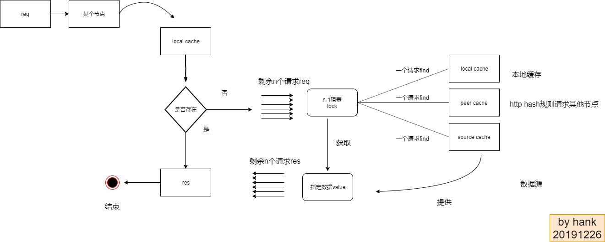

# groupcache-annotated

### singleflight
如果某个节点同时收到N个对于同一个key的请求的查询请求,但是请求的key不在当前节点上,
singleflight会自动阻塞N-1个请求,只执行其中一个请求,去其他节点或数据库中fetch数据.
最后才恢复N个请求,把数据放到N个请求中返回。因为无论多少个对同一个key的查询请求并
发到达,只执行一次查询，所以并发查询效率很高。

    